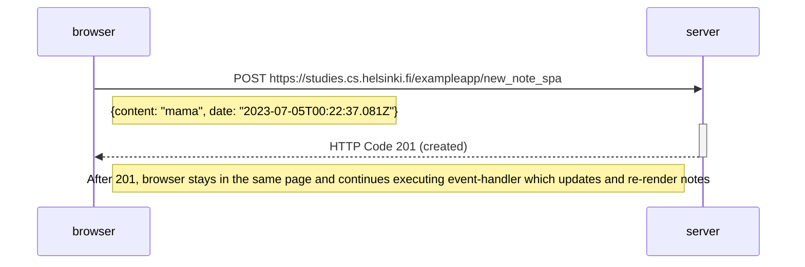

# Exercise 0.6 diagram

```mermaid
sequenceDiagram
    participant browser
    participant server

    browser->>server: POST https://studies.cs.helsinki.fi/exampleapp/new_note_spa
    Note right of browser: {content: "mama", date: "2023-07-05T00:22:37.081Z"}
    activate server
    server-->>browser: HTTP Code 201 (created)
    deactivate server

    Note right of browser: After 201, browser stays in the same page and continues executing event-handler which updates and re-render notes 
```